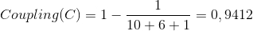

# Software Quality Measures

Measure the quality of software is not a trivial task in software engineering. Many metrics have been developed to achieve this aim.
In the most general sense, software quality can be defined as: An effective software process applied in a manner that creates a useful product that provides measurable value for those who produce it and those who use it [1].

There are several widely accepted metrics to measure code quality that are currently being used in both research and practice to detect code smells and to find opportunities for code improvement.

We are interested in measuring some metrics about software quality. In this document, we define these metrics and how to measure them with examples of Java codes.

## 1) Cyclomatic Complexity

Cyclomatic complexity is a software metric used to indicate the complexity of a program. It is a quantitative measure of the number of linearly independent paths through a program's source code [3].

Many software testing tools include a statistic known as the McCabe cyclomatic complexity metric in their reports. This metric is a calculation of how many different linear paths of execution there are through a given class or method. The metric itself has important implications for developers writing unit tests who want 100% code coverage. 

The cyclomatic complexity metric is always provided as a whole number. The lower the number is, the fewer linear paths of execution the code contains. 

### Calculate cyclomatic complexity in Java

In a modern approach, especially for the Java developer, we can simplify the McCabe cyclomatic complexity metric calculation with the following rules [4]:

- Assign one point to account for the start of the method.
- Add one point for each conditional construct, such as an "if" condition.
- Add one point for each iterative structure (for, while).
- Add one point for each case or default block in a switch statement.
- Add one point for any additional boolean condition, such as the use of && or ||.

Let's check an example:

```
public static Long sum(Long[] a) {
        Long sum = 0L;
        for(Long x : a) {
            sum += x;
        }
        return sum;
    }
```

For the method *sum(Long[] a)* we assigned 1 point to the start of the method and 1 point for the iterative structure (for). The McCabe cyclomatic complexity for this method is 2.

Let's see the same in a class:

```
class LongNumber {

    /* Complete this function */
    public static Long sum(Long[] a) {
        Long sum = 0L;
        for(Long x : a) {
            sum += x;
        }
        return sum;
    }

    /* Complete this function */
    public static Long add(Long x, Long y) {
        return (x+y);
    }

    /* Complete this function */
    public static Long subtract(Long x, Long y) {
        return (x-y);
    }

    /* Complete this function */
    public static Long multiply(Long x, Long y) {
        return (x*y);
    }

    /* Complete this function */
    public static Long product(Long[] a) {
        Long pro = 1L;
        for(Long x : a) {
            pro *= x;
        }
        return pro;
    }

    /* Complete this function */
    public static Long divide(Long x, Long y) {
        return (x/y);
    }
}
```

The class *LongNumber* has six methods. We assigned 6 points to start. And then, 1 point for each iterative structure in methods *sum(Long[] a)* and *product(Long[] a)*. The McCabe cyclomatic complexity for this class is 8.

If the file that you are working has more than one class, you need to measure the average of McCabe cyclomatic complexity for all classes in the file. For instance, you are working in a file that has two classes. The first class has 8 points of complexity and the second class has 6 points of complexity. Then the average of complexity in the file is 7.


## 2) Coupling

In software engineering, coupling is the degree of interdependence between software modules. It is a measure of how closely connected two routines or modules are [5].

Coupling is usually contrasted with cohesion. Low coupling often correlates with high cohesion, and vice versa. Low coupling is often a sign of a well-structured computer system and a good design, and when combined with high cohesion, supports the general goals of high readability and maintainability [6].

For purposes of this task, we define a Module coupling as [6]:


 


#### For data and control flow coupling:

**di**: number of input data parameters

**ci**: number of input control parameters

**do**: number of output data parameters

**co**: number of output control parameters


#### For global coupling:

**gd**: number of global variables used as data

**gc**: number of global variables used as control


#### For environmental coupling:

**w**: number of modules called (fan-out)

**r**: number of modules calling the module under consideration (fan-in)

#### Example

Using the Module Coupling we can measure the Coupling of a class. Let's calculate the Coupling for class *LongNumber* presented above.

**di**= 10 (all data parameters passed in the methods of the class).

**do**= 6 (all parameters returned by the methods of the class).

The class hasn't any input or output control parameters. **ci**=0; **co**=0

The class hasn't any global variables. **gd**=0; **gc**=0

The class hasn't any modules called. **w**=0;

For purposes of this task, we assume there is at least one module calling the class. **r**=1

 

Again, if the file that you are working has more than one class, you need to average the Coupling of the file per class. The average is the sum of Coupling of all classes divided by the number of classes.

## 3) Clarity

Code reading is one of the most frequent activities in software maintenance; before implementing changes, it is necessary to fully understand source code often written by other developers. Thus, readability is a crucial aspect of source code that might significantly influence program comprehension effort [7]. Sometimes, readability is called the Clarity of the code.

There are many works in software clarity. Some of them created models to evaluate the clarity of code using features [2].
We will use some of these features to measure the clarity of the scripts.

- indentation: properly indentation of code.

High grades are related to a properly indentation of classes and methods.

- comments: use of comments to explain how methods work.

If there are comments in the code and they explain how methods work.

- variables names: properly named variables.

The name of the variable describes properly the variable. Can you understand the purpose of the variable reading its name? 

- reuse: reuse of code. repeated code is not good.

High grades are related to non-repeated code.

- single responsibility: methods have one only responsibility.

Only one responsibility for each method is related to high grades.

- short methods: methods are coded in a few lines.

Methods are simple and written in a few lines.

We can create a measure of clarity by grading these features. You need to read the code of the script contained in the file and grade from **0** to **5** each of these features. 

## 4) Readability

We define readability as a human judgment of how easy a text is to understand. The readability of a program is related to its maintainability and is thus a key factor in overall software quality.

For the purposes of this task, we define Readability as an average of all Clarity features measured.

For instance:

- identantion : 5
- comments : 3
- variables names: 4
- reuse: 5
- single responsibility: 5
- short methods: 4

Average: 4.33 (overall readability)

## References

[1] Pressman, R. S. (2005). Software engineering: a practitioner's approach. Palgrave Macmillan.

[2] Fakhoury, S., Roy, D., Hassan, S. A., & Arnaoudova, V. (2019, May). Improving source code readability: theory and practice. In Proceedings of the 27th International Conference on Program Comprehension (pp. 2-12). IEEE Press.

[3] https://en.wikipedia.org/wiki/Cyclomatic_complexity

[4] https://www.theserverside.com/feature/How-to-calculate-McCabe-cyclomatic-complexity-in-Java

[5] ISO/IEC TR 19759:2005, Software Engineering — Guide to the Software Engineering Body of Knowledge (SWEBOK)

[6] https://en.wikipedia.org/wiki/Coupling_(computer_programming)

[7] Scalabrino, S., Linares-Vasquez, M., Poshyvanyk, D., & Oliveto, R. (2016, May). Improving code readability models with textual features. In 2016 IEEE 24th International Conference on Program Comprehension (ICPC) (pp. 1-10). IEEE.
