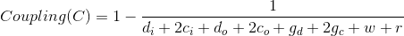

# Software Quality Measures

Measure the quality of software is not a trivial task in software engineering. Many metrics have been developed to achieve this aim.
In the most general sense, software quality can be defined as: An effective software process applied in a manner that creates a useful product that provides measurable value for those who produce it and those who use it [1].

We are interested in measuring some metrics about software quality. In this document, we define these metrics and how to measure them with examples.

## 1) Cyclomatic Complexity

Cyclomatic complexity is a software metric used to indicate the complexity of a program. It is a quantitative measure of the number of linearly independent paths through a program's source code.

Many software testing tools include a statistic known as the McCabe cyclomatic complexity metric in their reports. This metric is a calculation of how many different linear paths of execution there are through a given class or method. The metric itself has important implications for developers writing unit tests who want 100% code coverage. 

The cyclomatic complexity metric is always provided as a whole number. The lower the number is, the fewer linear paths of execution the code contains. 

### Calculate cyclomatic complexity in Java

In a modern approach, especially for the Java developer, we can simplify the McCabe cyclomatic complexity metric calculation with the following rules:

- Assign one point to account for the start of the method.
- Add one point for each conditional construct, such as an "if" condition.
- Add one point for each iterative structure (for, while).
- Add one point for each case or default block in a switch statement.
- Add one point for any additional boolean condition, such as the use of && or ||.

Let's check an example:

```
public static Long sum(Long[] a) {
        Long sum = 0L;
        for(Long x : a) {
            sum += x;
        }
        return sum;
    }
```

For the method *sum(Long[] a)* we assigned 1 point to the start of the method and 1 point for the iterative structure (for). The McCabe cyclomatic complexity for this method is 2.

Let's see the same in a class:

```
class LongNumber {

    /* Complete this function */
    public static Long sum(Long[] a) {
        Long sum = 0L;
        for(Long x : a) {
            sum += x;
        }
        return sum;
    }

    /* Complete this function */
    public static Long add(Long x, Long y) {
        return (x+y);
    }

    /* Complete this function */
    public static Long subtract(Long x, Long y) {
        return (x-y);
    }

    /* Complete this function */
    public static Long multiply(Long x, Long y) {
        return (x*y);
    }

    /* Complete this function */
    public static Long product(Long[] a) {
        Long pro = 1L;
        for(Long x : a) {
            pro *= x;
        }
        return pro;
    }

    /* Complete this function */
    public static Long divide(Long x, Long y) {
        return (x/y);
    }
}
```

The class *LongNumber* has six methods. We assigned 6 points to start. And then, 1 point for each iterative structure in methods *sum(Long[] a)* and *product(Long[] a)*. The McCabe cyclomatic complexity for this class is 8.

If the file that you are working has more than one class, we can measure the average of McCabe cyclomatic complexity for all classes in the file. For an instance, you are working in a file that has two classes. The first class has 8 points of complexity and the second class has 6 points of complexity. Then the average of complexity in the file is 7.


## 2) Coupling

In software engineering, coupling is the degree of interdependence between software modules. It is a measure of how closely connected two routines or modules are.

Coupling is usually contrasted with cohesion. Low coupling often correlates with high cohesion, and vice versa. Low coupling is often a sign of a well-structured computer system and a good design, and when combined with high cohesion, supports the general goals of high readability and maintainability.

 

## 3) Clarity

## 4) Readability

## References

[1] Pressman, R. S. (2005). Software engineering: a practitioner's approach. Palgrave Macmillan.
